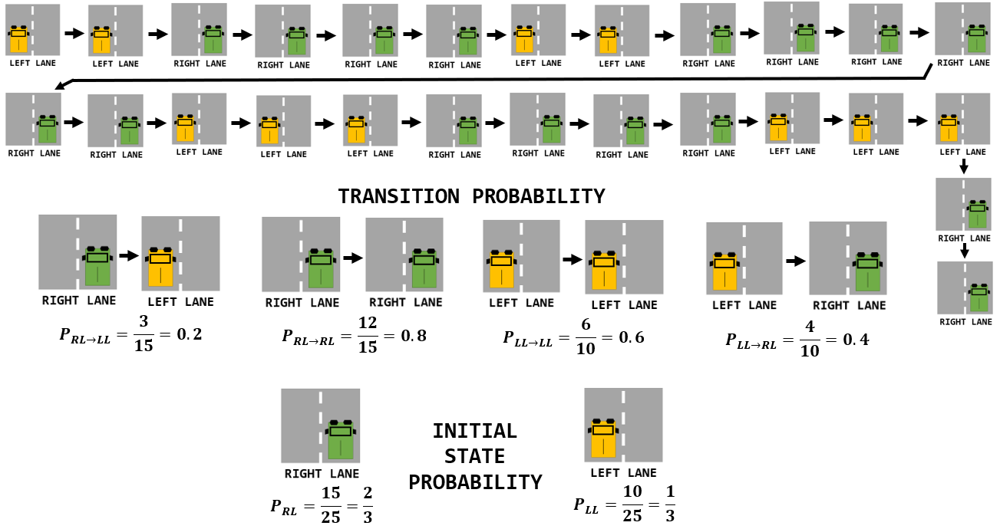
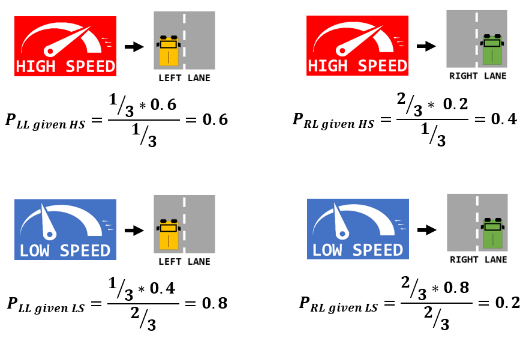

# hmm_for_autonomous_driving

# Introduction
Disclaimer:

- The goal of this repository is to get more familiar with the concepts of **`Hidden Markov Models`** (**= HMM**).
- The scope of ambition is therefore limited and the examples are very simple, only serving educational purposes.

Addressed topics:
- Problem setting using a basic example to introduce the **HMM terminology**.
- Implementation of the **Viterbi Algorithm** for training Hidden Markov Models.
- Implementation of the **Baum–Welch Algorithm** to find the maximum likelihood estimate of the parameters of the HMM.

# Problem motivation
For left-hand-drive countries such as the UK, just invert the reasoning :smiley:

- Your car is driving on a **2-lane highway**.
- Imagine that you can **remotely monitor the velocity of the car (I communicate it to you)**
- But you do have **no direct access to the lateral position** (`right lane` of `left lane`).
- How could you deduce the `lane` based on the single information we receive: the `speed`?

#### Emission probability

If I am telling you that I am driving with a `low speed`, you **may deduce** that I am on the right lane.
- For instance, because I am just driving alone at a reasonable pace
- Or because I am blocked by a slow vehicle.
- But I could also drive fast on this `right lane` *(have you ever been driving alone on a German highway?)*

Similarly, if you get informed of a `high speed`, you could say that I am **more likely** to be driving on the left lane.
- Probably overtaking another vehicle.
- Nevertheless, this is **not always true**: think of the situation where you are waiting on the left lane behind a truck trying to overtake another truck

We get a **first intuition**:
- The variable `lane` seems to have an impact on the variable `speed`.
- In  other words: *a priori* **you do not drive at the same pace depending if you are one the `left lane` or the `right lane`**.
- But the relation is **not deterministic**, rather **stochastic**.

This finding will be modelled using **`emission probabilities`** in the following.

#### Transition probability

You could have another intuition:
- Human drivers usually **stay on their lanes**.
- Hence if you are on `right lane` at time `t`, you are likely to still be on `right lane` at time `t+1`.
- Again, this **does not always hold** and you can find **exception**.
- But here comes a second intuition: *a priori* **the `lane` at time `t` is influenced by the `lane` at time `t-1`**.

The concept of **`transition probability`** will be used to model this second remark.

### Terminology

|   | 
|:--:| 
| *The speed is the `observation` while the lane constitutes the `hidden state`. Some examples show that all `emissions` are possible* |

### Objective

> We want to **infer the lane** (`right` of `left`) of the car (= **hidden state**) based on a **sequence of speed measurements** (= **observation**)

### Assumptions
To keep the problem as simple as possible:
- Let's **discretize the speed** into `low speed` and `high speed`.
- Time steps are discretized.
- Lane transitions are ignored: either you are on `left lane` or you are on `right lane`

A word about the **Markov Property**:
- We just said that it is useful to know the present `lane` (at time `t`) to infer the future `lane` (at time `t+1`)
- What about the previous `lane` at `t-1`? It probably also hold relevant information?
- Here is a strong assumption about inferring in this stochastic process:
	- the conditional probability distribution of **future states** of the process (conditional on both past and present states) **depends only upon the present state**, not on the sequence of events that preceded it.
- In other words, **"the future is independant of the past given the present"**
- This strong assumption is known as the **Markov Property** (also named **"memoryless property"**) and will make computations easier in the following.

# Problem formulation

- **Hidden state**: discrete random variable `lane` in {`Right Lane`, `Left Lane`}
- **Observation**: discrete random variable `speed` in {`Low Speed`, `High Speed`}
- **Emission probability**: `P[speed(t)` given `lane(t)]`
- **Transition probability**: `P[lane(t+1)` given `lane(t)]`
- **Prior probability**: `P[lane(t)]`
- **Marginal probability**: `P[speed(t)]`
- **Posterior probability**: `P[lane(t)` given `speed(t)]`

# Questions:
- [Q1](#q1) - How to **derive the probability models**?
- [Q2](#q2) - If you receive a **single observation**, what are the probability for the car to be in each lane?
- [Q3](#q3) - What is the **most likely `lane` sequence** if the **sequence of observations** is [`high speed`, `high speed`, `low speed`, `high speed`]?
- [Q4](#q4) - What if you are **not directly given the probability models**?

# Answers

## Q1 - How to derive the probability models?

Let assume we are given some data: a sequence of observations and states.
- Here are only a few for simplicity but you could imagine longer recordings.
- You can think of it as some **samples** of the underlying **joint distributions**.

The idea is to **approximate the model parameters by counting the occurrences**.

### Transition probability

**Counting the number** of transitions gives a likelihoods we can used for our **transition probability** model.
- For instance, among the `15` transitions starting from `right lane`, `3` ended in `left lane`.
	- Hence P[`right lane` -> `left lane`] = `0.2`
- Since probabilities must sum to one (normalization), or just by counting for the other case (`right lane` is followed `12` times by a `right lane`)
	- Hence P[`right lane` -> `right lane`] = `0.8`

|   | 
|:--:| 
| *Derivation of the transition probability model* |

### Emission probability

Counting can also be used to determine the **emission probability** model.
- For instance, how many times a `left lane` has caused a `high speed`?
- Note: in the **Bayesian framework**, we will see that it corresponds to the **Likelihood**.

|   | 
|:--:| 
| *Derivation of the emission probability model* |

## Prior probability

At any time `t`, what is your guess on the **distribution of the hidden state if no observation is given**?
- Two options are available:
	- Either you use the transition model (1) and the fact that probabilities sum to `1` (2):
		- (1) P[`left lane`, `t`] = P[`left lane` -> `left lane`] `*` P[`left lane`, `t-1`] + P[`right lane` -> `left lane`] `*` P[`right lane`, `t-1`]
		- (2) P[`right lane`, `t`] = `1` - P[`left lane`, `t`]
	- Either you simply **count occurrences** in the supplied data:
		- P[`left lane`, `t`] = `1/3`
		- P[`right lane`, `t`] = `2/3`

### Summary

| , `transition probability` model (middle), and the `emission probability` model (below)")  | 
|:--:| 
| *Hidden Markov Model with the `prior probability` model (up), `transition probability` model (middle), and the `emission probability` model (below)* |

## Q2 - If you receive a single observation, what are the probability for the car to be in each lane?

### Prior

Before any observation we know that `right lane` appears `2/3` of the time and `left lane` `1/3`.
- These probabilities would have been the answers if we were to **ignore the observation**.
- This distribution (called `prior`) must be **updated** when considering the observation.
- The `prior` is converted to a `posterior` using `likelihood` as `observations` are considered.

### Likelihood

Based on supplied data, we found that on the left lane it is more likely to drive fast. And slow on the right lane.
- This led to `emission probability`, also understood as `likelihood`:
	- **given a state**, what is the probability for each observation.
- In the `posterior`, it is the **opposite** that apply:
	- **given an observation**, what is the probability for each state?

### Marginal
The Bayes Rule states that `Posterior` = `Normalized (prior * likelihood)`
- The normalization is done using the `Marginal Probabilities`
- Under all possible hypothesese, how probable is each `speed`?
- Using the **law of total probability**:
	- P(`high speed`) = P(`high speed` given `left lane`) `*` P(`left lane`) + P(`high speed` given `right lane`) `*` P(`right lane`)
	- P(`low speed`) = P(`low speed` given `left lane`) `*` P(`left lane`) + P(`low speed` given `right lane`) `*` P(`right lane`)
- Eventually:
	- P(`high speed`) = `1/3`
	- P(`low speed`) = `2/3`

### Bayes Rule
- Let's use Bayesian Statistics to recap:
	- P(`lane` given `speed`) = P(`lane`) `*` P(`speed` given `lane`) / P(`speed`)
	- `Posterior` = `Prior` `*` `Likelihood` / `Marginal`
- For instance
	- P(`left lane` given `high speed`) = P(`left lane`) `*` P(`high speed` given `left lane`) / P(`high speed`)

Priors:
- P(`right lane`) = `2/3`
- P(`left lane`) = `1/3`

Marginals:
- P(`high speed`) = `1/3`
- P(`low speed`) = `2/3`

Likelihoods:
- P(`high speed` given `left lane`) = `0.6`
- P(`low speed` given `left lane`) = `0.4`
- P(`high speed` given `right lane`) = `0.2`
- P(`low speed` given `right lane`) = `0.8`

Posteriors:
- P(`left lane` given `high speed`) = `1/3` `*` `0.6` / `1/3` = `0.6`
- P(`left lane` given `low speed`) = `1/3` `*` `0.4` / `2/3` = `0.2`
- P(`right lane` given `high speed`) = `2/3` `*` `0.2` / `1/3` = `0.4`
- P(`right lane` given `low speed`) = `2/3` `*` `0.8` / `2/3` = `0.8`

### Summary

The question was *given an observation, what is the most likely hidden state?*.
Well, just looking at the numbers on the figure below and taking the `max`, the answer is:

- Given `high speed` is observed, the most likely state is `left lane`
- Given `low speed` is observed, the most likely state is `right lane`

It is close to our intuition.

|   | 
|:--:| 
| *Derivation of the posterior probabilities for a single observation* |

## Q3 - What is the most likely `lane` sequence if the sequence of observations is [`high speed`, `high speed`, `low speed`, `high speed`]?

The previous sequence of `observation` had `size=1`
- For each observation we have computed the two posterior probabilities and then **select the maximum one**.
- A **similar approach** can be used for larger sequences of observation.

But an issue appears:

| Size of the `observation` sequence | Number of posteriors to compute before applying `max()` |
| :---:        |     :---:      |
| `1`   | `4`     |
| `2`   | `8`     |
| `3`   | `16`     |
| `i`     | `2*2^i`       |
| `10`     | `2048`       |

### Dynamic Programming

Assume that after the second observation, the sub-sequence (`left lane`, `right lane`) is found to be more likely that the sub-sequence (`right lane`, `right lane`).
- Is it **worth carry on some investigation** in the branch (`left lane`, `right lane`)?
- Do not forget that the only goal is to **find the most likely sequence (and nothing else)!**
- Whatever you append to (`left lane`, `right lane`), the resulting sequence will be less likely than appending the same to (`right lane`, `right lane`).

This example show the intuition of `Dynamic Programming`:
- Compute local blocks and consider only the most promising ones to build the next ones.

## Q4 - What if you are **not directly given the probability models**?

### EM algorithm

# Further work
Ideas to go further:
- at a crossing, make prediction of the route of other vehicles
	- `route` in {`left`, `straight`, `right`} is the hidden variable

# Acknowledgement and references
I took some inspiration of this [video](https://www.youtube.com/watch?v=kqSzLo9fenk) by Luis Serrano.